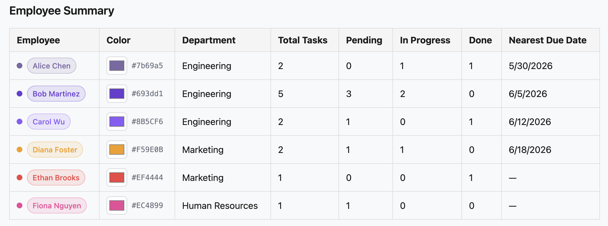
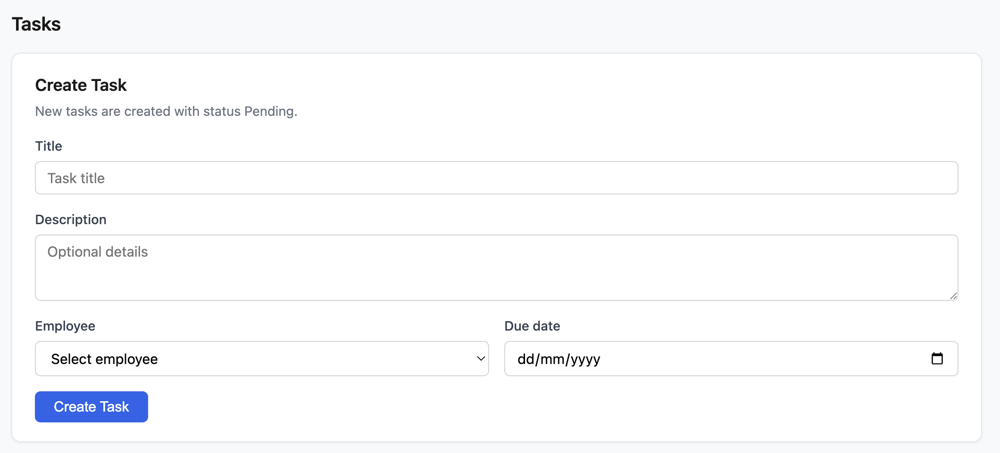
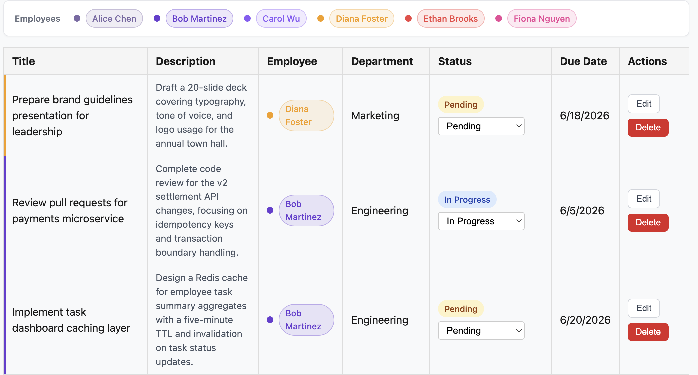

# Employee Task Manager

A full-stack **Employee Task Management System** built for the Deloitte Junior Full Stack Developer home assignment. The project demonstrates relational database design in **Microsoft SQL Server**, business logic in **stored procedures**, a lightweight **Express** API, and an interactive **React** dashboard.

Managers can view employee workload summaries and update task statuses through a clean web UI, while all data rules are enforced at the database layer.

---

## Features

- **Employee summary dashboard** — per-employee task counts by status, department, and nearest upcoming due date
- **Task management** — full task list with assignee and department context
- **Create tasks** — assign new work from the dashboard (always starts as **Pending**)
- **Delete tasks** — remove tasks from the tasks table with confirmation
- **Edit tasks** — update title, description, assignee, and due date (status unchanged)
- **Employee color themes** — customizable per-employee colors across summaries and task rows
- **Interactive status updates** — change task status from the UI with forward-only workflow validation
- **MSSQL stored procedures** — all API database access goes through stored procedures (no inline SQL in the backend)
- **Transactions and validation** — `TRY/CATCH`, meaningful `RAISERROR` messages, and transactional reassignment in `usp_AssignTask`
- **API testing** — Jest + Supertest integration tests for employee and task endpoints

---

## Architecture

```txt
React (Vite)  →  Express API  →  Stored Procedures  →  MSSQL (Docker)
```

| Layer | Responsibility |
|-------|----------------|
| **Frontend** | Dashboard UI, Axios HTTP client, loading and error states |
| **Backend** | REST routing, request validation, procedure execution via `mssql` |
| **Database** | Schema constraints, indexes, business rules, and data access in T-SQL |

---

## Tech Stack

| Area | Technologies |
|------|----------------|
| Frontend | React, Vite, Axios |
| Backend | Node.js, Express, `mssql`, CORS |
| Database | Microsoft SQL Server (Azure SQL Edge in Docker) |
| Testing | Jest, Supertest |
| Tooling | Docker, `sqlcmd` |

---

## Project Structure

```txt
Task_Manager_System/
├── backend/
│   ├── .env.example
│   ├── src/
│   │   ├── app.js                 # Express app (routes, middleware)
│   │   ├── server.js              # HTTP entry point
│   │   ├── controllers/           # Request handlers → stored procedures
│   │   ├── routes/                # /employees, /tasks
│   │   └── db/connection.js       # MSSQL connection pool
│   └── tests/                     # Jest + Supertest
├── frontend/
│   ├── src/
│   │   ├── App.jsx
│   │   ├── components/
│   │   │   ├── EmployeeTable.jsx
│   │   │   └── TasksTable.jsx
│   │   └── services/api.js
│   └── .env.example
├── db/
│   ├── schema.sql
│   ├── seed.sql
│   └── stored_procedures.sql
├── docs/
│   ├── database-design.md
│   ├── project-plan.md
│   └── images/
│       ├── employee-summary.png
│       ├── create-task.png
│       └── task-display.png
└── README.md
```

---

## Getting Started

### Prerequisites

- [Node.js](https://nodejs.org/) 18+
- [Docker](https://www.docker.com/)
- Git

### A. Clone the repository

```bash
git clone <your-repo-url>
cd Task_Manager_System
```

### B. Start the MSSQL Docker container

Run Azure SQL Edge locally (suitable for Apple Silicon with `--platform linux/amd64`):

```bash
docker run --platform linux/amd64 \
  -e ACCEPT_EULA=Y \
  -e MSSQL_SA_PASSWORD=YourStrongPassword123! \
  -p 1433:1433 \
  --name task-manager-mssql \
  -d mcr.microsoft.com/azure-sql-edge
```

Wait until the container is healthy before running SQL scripts.

> **Note:** On macOS, port **5000** is often used by AirPlay Receiver. The API defaults to port **5001** to avoid conflicts.

### C. Initialize the database

From the **project root**, run scripts in order:

**1. Schema**

```bash
docker exec -i task-manager-mssql /opt/mssql-tools/bin/sqlcmd \
  -S localhost -U sa -P 'YourStrongPassword123!' -C < db/schema.sql
```

**2. Seed data**

```bash
docker exec -i task-manager-mssql /opt/mssql-tools/bin/sqlcmd \
  -S localhost -U sa -P 'YourStrongPassword123!' -C < db/seed.sql
```

**3. Stored procedures**

```bash
docker exec -i task-manager-mssql /opt/mssql-tools/bin/sqlcmd \
  -S localhost -U sa -P 'YourStrongPassword123!' -C < db/stored_procedures.sql
```

### D. Backend setup

Copy the environment template and adjust if needed:

```bash
cp backend/.env.example backend/.env
```

`backend/.env.example` defines `PORT`, `DB_USER`, `DB_PASSWORD`, `DB_SERVER`, `DB_PORT`, and `DB_NAME` (defaults match the Docker setup above).

Install and run:

```bash
cd backend
npm install
npm start
```

The API listens at `http://localhost:5001`. Verify with:

```bash
curl http://localhost:5001/health
```

Run tests (requires database with seed data):

```bash
npm test
```

### E. Frontend setup

```bash
cd frontend
npm install
npm run dev
```

Open the URL shown in the terminal (typically `http://localhost:5173`).

Optional: copy `frontend/.env.example` to `frontend/.env` if you need a custom API URL:

```env
VITE_API_BASE_URL=http://localhost:5001
```

---

## API Endpoints

| Method | Endpoint | Stored procedure | Description |
|--------|----------|------------------|-------------|
| `GET` | `/health` | — | API health check |
| `GET` | `/employees` | `usp_GetEmployeeTaskSummary` | Employee task statistics |
| `PATCH` | `/employees/:id/color` | `usp_UpdateEmployeeColor` | Update employee dashboard color |
| `GET` | `/tasks` | `usp_GetAllTasks` | All tasks with employee and department |
| `POST` | `/tasks` | `usp_CreateTask` | Create a task (status **Pending**) |
| `PUT` | `/tasks/:id` | `usp_UpdateTaskDetails` | Update title, description, assignee, due date |
| `PATCH` | `/tasks/:id/status` | `usp_UpdateTaskStatus` | Update task status (forward-only) |
| `DELETE` | `/tasks/:id` | `usp_DeleteTask` | Permanently delete a task |

### Example: update task status

```http
PATCH /tasks/6/status
Content-Type: application/json
```

```json
{
  "status": "In Progress"
}
```

**Allowed statuses:** `Pending`, `In Progress`, `Done`

**Valid transitions:**

```txt
Pending  →  In Progress  →  Done
```

Invalid transitions return an error message (e.g. `Invalid status transition. In Progress can only move to Done.`).

### Example: create task

```http
POST /tasks
Content-Type: application/json
```

```json
{
  "title": "Prepare quarterly report",
  "description": "Optional details for the assignee",
  "assignedTo": 1,
  "dueDate": "2026-06-30"
}
```

Success (`201`):

```json
{
  "message": "Task created successfully.",
  "task_id": 1001
}
```

### Example responses

**GET /employees** — array of summary rows:

```json
{
  "employee_id": 1,
  "employee_full_name": "Alice Chen",
  "department_name": "Engineering",
  "total_tasks": 2,
  "pending_tasks": 0,
  "in_progress_tasks": 1,
  "done_tasks": 1,
  "nearest_upcoming_due_date": "2026-05-30T17:00:00.000Z"
}
```

**GET /tasks** — array of task rows:

```json
{
  "task_id": 6,
  "title": "Review pull requests for payments microservice",
  "description": "Complete code review for the v2 settlement API changes.",
  "status": "In Progress",
  "due_date": "2026-06-05T17:00:00.000Z",
  "employee_full_name": "Bob Martinez",
  "department_name": "Engineering"
}
```

---

## Testing

Backend tests live in `backend/tests/` and use **Jest** with **Supertest** against the Express app (no separate server process). They hit the real MSSQL database configured in `backend/.env`, so Docker must be running with schema, seed, and stored procedures applied.

### What is covered

| Suite | Coverage |
|-------|----------|
| `health.test.js` | `GET /health` — liveness response |
| `employees.test.js` | `GET /employees` — status, array shape, summary fields |
| `tasks.test.js` | `GET /tasks` — status, array shape, task fields |
| `tasks.test.js` | `POST /tasks` — validation (400), invalid employee (500), successful create (201) |
| `tasks.test.js` | `PATCH /tasks/:id/status` — valid and invalid transitions |
| `tasks.test.js` | `PUT /tasks/:id` — validation, not found, successful update |
| `tasks.test.js` | `DELETE /tasks/:id` — not found (404), successful delete (200) |

`PATCH` tests create their own task via `POST` first, so they do not depend on seed data still having a **Pending** row.

### Run tests

From `backend/`:

```bash
npm test
```

### Prerequisites

- MSSQL container running
- `backend/.env` (from `backend/.env.example`) pointing at the database
- Stored procedures deployed (`db/stored_procedures.sql`), including `usp_CreateTask` and `usp_DeleteTask`
- At least one employee in seed data (e.g. `employee_id = 1`) for create/PATCH tests

### Why add more tests?

The original suite only checked HTTP status codes. The expanded tests also verify **request validation**, **response shapes**, **create-task workflow**, and **status transition rules** — the same behaviors the React dashboard relies on. That gives higher confidence before submission without needing frontend test tooling for this assignment scope.

---

## Database Design

The database **`TaskManagerDB`** models three core entities: **departments**, **employees**, and **tasks**.

Detailed documentation: [`docs/database-design.md`](docs/database-design.md)  
ERD: [`docs/images/erd.png`](docs/images/erd.png)

### Integrity and constraints

- **Primary keys** on `department_id`, `employee_id`, `task_id`
- **Foreign keys** — employees → departments, tasks → employees
- **UNIQUE** constraint on employee `email`
- **CHECK** constraint on task `status` (`Pending`, `In Progress`, `Done`)
- **NOT NULL** on required business fields

### Stored procedures

| Procedure | Purpose |
|-----------|---------|
| `usp_GetEmployeeTaskSummary` | Aggregated per-employee task metrics |
| `usp_UpdateEmployeeColor` | Persist employee `color_hex` for UI themes |
| `usp_GetAllTasks` | Task list with assignee and department |
| `usp_GetOverdueTasks` | Tasks past due date and not completed |
| `usp_CreateTask` | Insert new tasks with status **Pending** |
| `usp_UpdateTaskDetails` | Update title, description, assignee, due date |
| `usp_DeleteTask` | Permanently remove a task by ID |
| `usp_UpdateTaskStatus` | Forward-only status transitions |
| `usp_AssignTask` | Reassign open tasks with transaction safety |

### Indexes

| Index | Purpose |
|-------|---------|
| `IX_employees_department_id` | Department ↔ employee joins |
| `IX_tasks_assigned_to` | Employee ↔ task joins |
| `IX_tasks_status_due_date` | Status and overdue filtering |

### Status workflow

Forward-only transitions are enforced in `usp_UpdateTaskStatus`, not by ad hoc API logic:

```txt
Pending → In Progress → Done
```

---

## Screenshots

### Employee summary

Employee workload metrics and customizable color themes.



### Create task

New tasks are assigned to an employee with a due date and start as **Pending**.



### Tasks dashboard

Task list with employee color legend, status workflow, edit, and delete.



---

## Future Improvements

- **Authentication** — role-based access for managers vs. employees
- **Deployment** — containerized API and static frontend hosting
- **Pagination** — large task lists and employee directories
- **Filtering** — by department, status, overdue, or assignee
- **Docker Compose** — single command to start MSSQL, API, and frontend
- **Azure deployment** — Azure SQL Database, App Service, and CI/CD pipeline
- **Additional API surface** — expose `usp_GetOverdueTasks` and `usp_AssignTask` for reporting and reassignment workflows

---

## Documentation

| Document | Description |
|----------|-------------|
| [`docs/database-design.md`](docs/database-design.md) | Schema, relationships, constraints, indexes |
| [`docs/project-plan.md`](docs/project-plan.md) | Architecture and development plan |
| [`frontend/README.md`](frontend/README.md) | Frontend-specific setup and API notes |

---

## License

This project was developed as a home assignment submission. Use and distribution are subject to your assignment guidelines.
