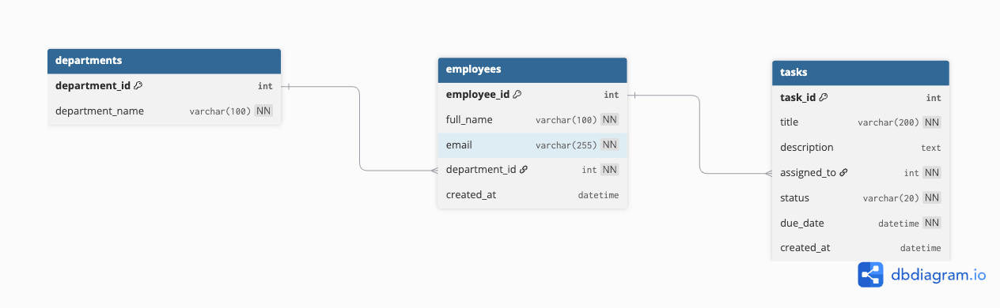

# Database Design

## Overview

The database for the Employee Task Manager system was designed using a relational Microsoft SQL Server (MSSQL) approach with a strong focus on:

* Data integrity
* Maintainability
* Clean SQL architecture
* Performance optimization
* Clear entity relationships

The system manages employees, departments, and tasks assigned to employees.

The database layer is the core of the application, and all backend communication is performed through stored procedures instead of inline SQL queries.

---

# ERD



---

# Database Entities

## 1. departments

The `departments` table stores organizational departments within the company.

### Columns

| Column          | Type         | Description     |
| --------------- | ------------ | --------------- |
| department_id   | INT          | Primary key     |
| department_name | VARCHAR(100) | Department name |

### Constraints

* Primary Key on `department_id`
* `department_name` is required

---

## 2. employees

The `employees` table stores employee information.

Each employee belongs to exactly one department.

### Columns

| Column        | Type         | Description                 |
| ------------- | ------------ | --------------------------- |
| employee_id   | INT          | Primary key                 |
| full_name     | VARCHAR(100) | Employee full name          |
| email         | VARCHAR(255) | Unique employee email       |
| department_id | INT          | Foreign key to departments  |
| created_at    | DATETIME     | Employee creation timestamp |

### Constraints

* Primary Key on `employee_id`
* Unique constraint on `email`
* Foreign Key:

  * `department_id -> departments.department_id`
* `created_at` uses `GETDATE()` by default

### Business Rules

* Every employee must belong to one department
* Email addresses must be unique

---

## 3. tasks

The `tasks` table stores tasks assigned to employees.

### Columns

| Column      | Type         | Description             |
| ----------- | ------------ | ----------------------- |
| task_id     | INT          | Primary key             |
| title       | VARCHAR(200) | Task title              |
| description | VARCHAR(MAX) | Task description        |
| assigned_to | INT          | Assigned employee       |
| status      | VARCHAR(20)  | Task status             |
| due_date    | DATETIME     | Task due date           |
| created_at  | DATETIME     | Task creation timestamp |

### Constraints

* Primary Key on `task_id`
* Foreign Key:

  * `assigned_to -> employees.employee_id`
* CHECK constraint on `status`
* `created_at` uses `GETDATE()` by default

### Allowed Status Values

```txt id="pc7nrf"
Pending
In Progress
Done
```

### Business Rules

* Every task must belong to one employee
* Only valid statuses are allowed
* Status transitions are enforced inside stored procedures

---

# Relationships

The database contains the following relationships:

```txt id="7pq6i2"
Departments 1 ---- * Employees
Employees   1 ---- * Tasks
```

## Relationship Explanation

### Departments → Employees

One department can contain multiple employees.

### Employees → Tasks

One employee can have multiple assigned tasks.

---

# Data Integrity

The schema uses several mechanisms to ensure data integrity:

## Primary Keys

Ensure each record is uniquely identifiable.

## Foreign Keys

Prevent invalid relationships between tables.

## Unique Constraints

Prevent duplicate employee emails.

## CHECK Constraints

Restrict task status values to approved business values only.

## NOT NULL Constraints

Ensure required data is always provided.

---

# Indexing Strategy

Indexes were added to improve query performance for joins and filtering operations used by the stored procedures.

## Implemented Indexes

| Index                      | Purpose                                           |
| -------------------------- | ------------------------------------------------- |
| IX_employees_department_id | Improve joins between employees and departments   |
| IX_tasks_assigned_to       | Improve employee-task joins                       |
| IX_tasks_status_due_date   | Improve overdue task and status filtering queries |

---

# Status Flow Logic

Task statuses follow a forward-only transition flow:

```txt id="n5mks0"
Pending -> In Progress -> Done
```

Backward transitions are not allowed.

This logic is enforced inside the stored procedure:

```txt id="x8wjlwm"
usp_UpdateTaskStatus
```

---

# Overdue Task Definition

A task is considered overdue when:

```sql id="vz6eh6"
due_date < GETDATE()
AND status != 'Done'
```

This logic is used by:

```txt id="sh6ll8"
usp_GetOverdueTasks
```

---

# Design Decisions

## Why Stored Procedures?

The project uses stored procedures to:

* Centralize business logic
* Improve maintainability
* Improve security
* Enforce validation rules at the database layer
* Match enterprise MSSQL development practices

---

## Why VARCHAR(MAX) Instead of TEXT?

`TEXT` is deprecated in modern MSSQL versions.

`VARCHAR(MAX)` provides better compatibility and maintainability.

---

## Why Idempotent Schema Scripts?

The schema was written using idempotent patterns (`IF NOT EXISTS`) to allow safe re-execution during development without breaking the database.

This improves the development workflow and simplifies database setup.
